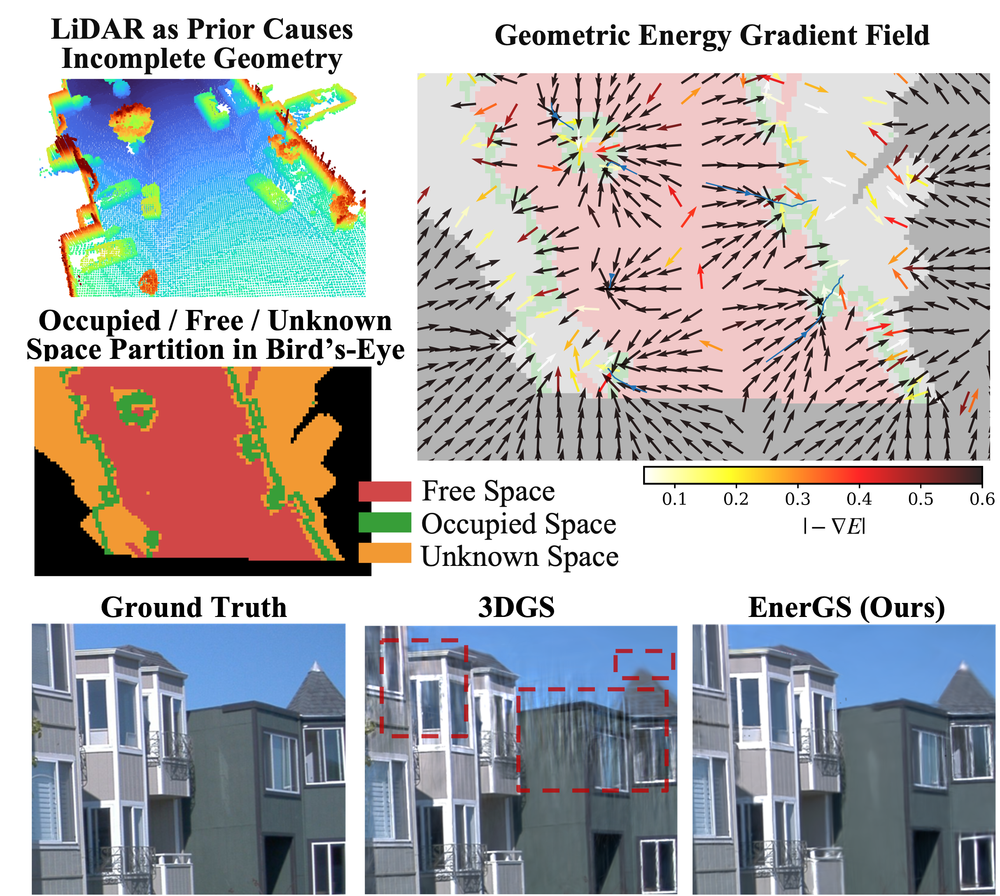

# EnerGS

[](https://arxiv.org/abs/2602.00000)


**[ICML 2026] EnerGS: Energy-Based Gaussian Splatting with Partial Geometric Priors**

[Rui Song](https://rruisong.github.io/)<sup>1,2</sup>, [Tianhui Cai](https://www.linkedin.com/in/tianhui-cai-a12839189/)<sup>1</sup>, [Markus Gross](https://markus-42.github.io/)<sup>3</sup>, [Yun Zhang](https://handsomeyun.github.io/)<sup>1</sup>, [Walter Zimmer](https://walzimmer.github.io/)<sup>1</sup>, [Zhiyu Huang](https://mczhi.github.io/)<sup>1</sup>, [Olaf Wysocki](https://olafwysocki.github.io/)<sup>2</sup>, [Jiaqi Ma](https://mobility-lab.seas.ucla.edu/about/)<sup>1</sup>

<sup>1</sup>University of California, Los Angeles &nbsp;&nbsp;
<sup>2</sup>University of Cambridge &nbsp;&nbsp;
<sup>3</sup>Technical University of Munich



## Overview

EnerGS reformulates partial geometric supervision in 3D Gaussian Splatting as a **continuous energy field** that provides soft, observability-aware guidance during optimization. Instead of treating LiDAR (or any partial geometric prior) as a hard constraint, EnerGS partitions space into Occupied / Free / Unknown regions and induces an adaptive potential landscape over them, enabling robust reconstruction in LiDAR-blind but camera-visible areas while still rejecting floaters in certified free space.

## Installation

### 1. Clone the repository

```bash
git clone --recursive https://github.com/ucla-mobility/EnerGS.git
cd EnerGS
```

### 2. Create the conda environment

**Option A: Provided environment file (CUDA 12.1)**

```bash
conda env create -f gs_cuda12.yaml
conda activate gs_cuda12
```

**Option B: Manual setup**

```bash
conda create -n energs python=3.10
conda activate energs

pip install torch torchvision torchaudio --index-url https://download.pytorch.org/whl/cu121
pip install plyfile tqdm scipy numpy pillow lpips
```

### 3. Build the CUDA extensions

```bash
pip install submodules/diff-gaussian-rasterization
pip install submodules/simple-knn
pip install submodules/fused-ssim  # optional, faster SSIM
```

## Data Preparation

EnerGS expects:

1. A standard 3DGS-style COLMAP scene.
2. A pre-computed geometric field cache `field_cache.npz` (Euclidean Distance Transform + region labels derived from LiDAR ray-tracing). The toolkit that generates this cache will be released alongside the dataset bundle.

Expected layout:

```
<scene>/
├── images/
├── sparse/0/
│   ├── cameras.bin
│   ├── images.bin
│   └── points3D.bin
└── field_cache.npz   # geometric energy / gradient field
```

## Training

```bash
python train_energs.py \
    -s <path/to/scene> \
    -m <output/path> \
    --field_npz <path/to/field_cache.npz> \
    --iterations 30000 \
    --eval
```

Key EnerGS-specific flags:

| Flag | Default | Description |
|------|---------|-------------|
| `--energs_w_occ` | 1.0 | Attractor weight in occupied space |
| `--energs_sigma_occ` | 1.0 | Welsch kernel bandwidth (m) in occupied space |
| `--energs_w_unk` | 0.25 | Weak attractor weight in unknown space |
| `--energs_barrier_lambda` | 2.0 | Boltzmann/Softplus barrier strength in free space |
| `--energs_relax_lr` | 0.005 | Geometric relax step size `η_μ` |
| `--energs_prune_free` | False | Enable discrete FREE-space pruning |

## Rendering and Evaluation

```bash
python render.py  -m <output/path>
python metrics.py -m <output/path>
```

Reported metrics include PSNR / SSIM (photometry) and Leak / OccCov / Margin / Thick (geometry), measured against a unified voxelized occupancy field derived from LiDAR.

## Project Structure

```
EnerGS/
├── train_energs.py        # Main training entrypoint
├── render.py              # Novel-view rendering
├── metrics.py             # PSNR / SSIM / geometry metrics
├── energs/                # EnerGS core module
│   ├── geometric_energy.py    # E_occ / E_free / E_unk and gradient field
│   ├── gaussian_model.py      # GaussianModelEnerGS (decoupled update)
│   └── coverage.py            # Coverage modulation / FREE pruning
├── scene/                 # Scene loading (COLMAP + field cache)
├── gaussian_renderer/     # Differentiable rasterization wrappers
├── arguments/             # CLI argument definitions
└── submodules/            # CUDA extensions
```

## Acknowledgments

EnerGS is built on top of [3D Gaussian Splatting](https://github.com/graphdeco-inria/gaussian-splatting) by Kerbl et al. We thank the authors of [3DGS](https://github.com/graphdeco-inria/gaussian-splatting), [2DGS](https://github.com/hbb1/2d-gaussian-splatting), [Taming-3DGS](https://github.com/humansensinglab/taming-3dgs), [GeoGaussian](https://github.com/yanyan-li/GeoGaussian), [Mip-Splatting](https://github.com/autonomousvision/mip-splatting), [Scaffold-GS](https://github.com/city-super/Scaffold-GS), [Street Gaussians](https://github.com/zju3dv/street_gaussians), [SplatAD](https://github.com/carlinds/splatad), and the broader Gaussian Splatting community for releasing their code.

## Citation

If you find this repository useful for your research, please consider giving us a star and citing our paper.

```bibtex
@inproceedings{song2026energs,
  title={EnerGS: Energy-Based Gaussian Splatting with Partial Geometric Priors},
  author={Song, Rui and Cai, Tianhui and Gross, Markus and Zhang, Yun and Zimmer, Walter and Huang, Zhiyu and Wysocki, Olaf and Ma, Jiaqi},
  booktitle={Proceedings of the International Conference on Machine Learning (ICML)},
  year={2026}
}
```
